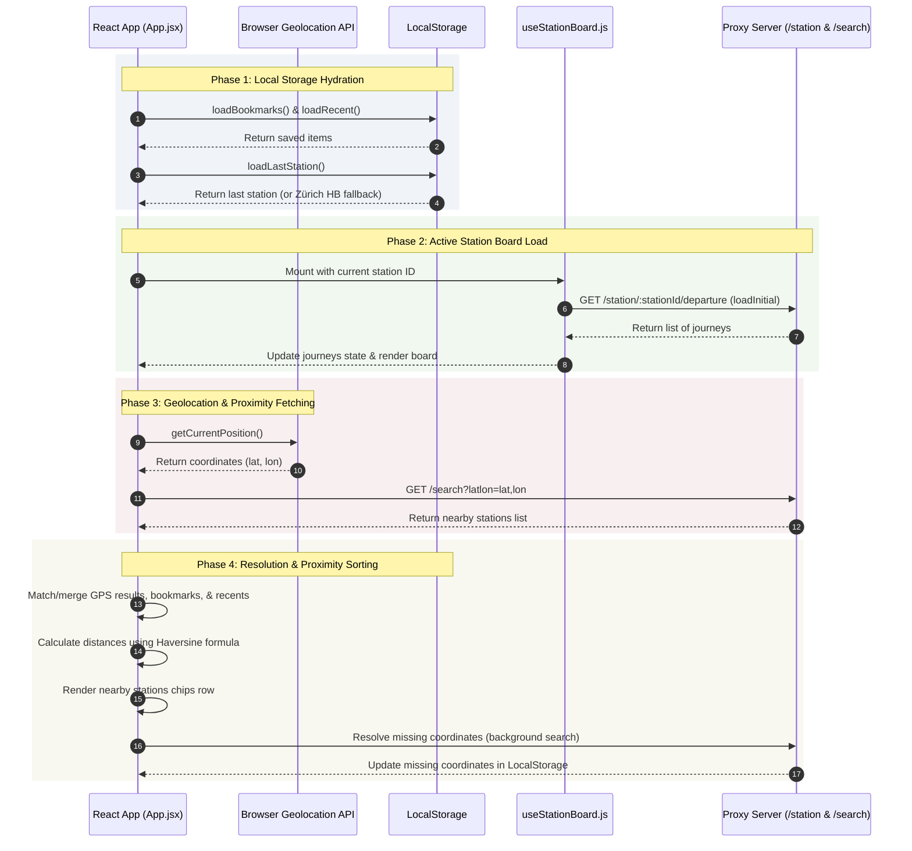

# App Startup Procedure Documentation

This document describes the step-by-step startup procedure of the Stationboard Web client application, tracing the code execution flow from mounting the entry point to displaying the station board, user geolocation, and proximity/favorites chips.

---

## Startup Sequence Diagram

The following diagram illustrates the sequence of actions occurring in the background during app startup.



---

## Detailed Step-by-Step Execution

### Phase 1: Initialization and Local Storage Hydration

When the React app launches (registered in [main.jsx](file:///home/zb/code/stationboard-node/web/src/main.jsx) and rendered from [App.jsx](file:///home/zb/code/stationboard-node/web/src/App.jsx)):

1. **Load Bookmarks**: [App.jsx](file:///home/zb/code/stationboard-node/web/src/App.jsx#L17-L24) calls `loadBookmarks()`, which reads the key `stationboard_bookmarks` from `localStorage` (falling back to `[]` if not present).
2. **Load Recent accesses**: [App.jsx](file:///home/zb/code/stationboard-node/web/src/App.jsx#L50-L57) calls `loadRecent()`, which reads `stationboard_recent` from `localStorage` (falling back to `[]`).
3. **Determine Initial Station (Navigation Stack)**: The navigation stack state `navStack` is initialized in [App.jsx](file:///home/zb/code/stationboard-node/web/src/App.jsx#L137-L139):
   ```javascript
   const [navStack, setNavStack] = useState(() => [
     { view: 'station', station: loadLastStation() },
   ]);
   ```
   * `loadLastStation()` checks `localStorage` for `stationboard_last_station`.
   * If a station was saved from the user's last session, the app resumes with that station active.
   * If no station is found, it defaults to **Zürich HB** (`id: '8503000'`, `name: 'Zürich HB'`, `lat: 47.378177`, `lon: 8.540192`).

---

### Phase 2: Active Station Board Loading

Once the active station is loaded into the state, the station board begins downloading departures:

1. **Instantiate useStationBoard Hook**: The app calls the custom hook [useStationBoard](file:///home/zb/code/stationboard-node/web/src/hooks/useStationBoard.js) passing `type` (`'departure'`) and the current station's `id`.
2. **Trigger Initial Load**: An effect in `useStationBoard.js` triggers whenever `type` or `stationId` changes, calling the `loadInitial(boardType)` function.
3. **Fetch Station Board**: [useStationBoard.js](file:///home/zb/code/stationboard-node/web/src/hooks/useStationBoard.js#L116-L147) calls `fetchStationBoard` from [api.js](file:///home/zb/code/stationboard-node/web/src/utils/api.js):
   * This queries the backend API endpoint: `/station/:stationId/departure`.
   * The API makes a SOAP/XML request upstream to OJP 2.0, parses the XML response, transforms it to clean JSON, and returns it.
4. **Deduplication and Sorting**:
   * Journeys are deduplicated using a Ref `seenKeys` (combining `journeyRef` and `operatingDayRef`).
   * Results are sorted by departure time and stored in the hook's `journeys` state, triggering a re-render to display connection rows on the main column headers board.

---

### Phase 3: Geolocation Request

While the station board is fetching:

1. **Trigger Browser Location API**: A mount effect in [App.jsx](file:///home/zb/code/stationboard-node/web/src/App.jsx#L188-L190) invokes `getPosition()`.
2. **Request GPS Coordinates**: `getPosition` calls `navigator.geolocation.getCurrentPosition` with a timeout of 10 seconds.
3. **Update State**: When GPS coordinates are retrieved, the app updates the `userLocation` state with `{ lat, lon, timestamp }`.

---

### Phase 4: Nearby Stations Row Rendering

Once `userLocation` coordinates are updated:

1. **Fetch Nearby Stations from GPS**: A `useEffect` in [App.jsx](file:///home/zb/code/stationboard-node/web/src/App.jsx#L193-L224) calls the search endpoint `/search?latlon=lat,lon`.
   * The proxy server queries the upstream OJP 2.0 API for location points near those coordinates.
   * The response is mapped and filtered to populate the state `closestApiStations`.
   * > [!NOTE]
     > **Why this API call is necessary:** Bookmarks and recent station history are saved locally in the browser. If the user travels to a new area or city where they have never bookmarked or visited any stations, the local database will not have any stations nearby. The `/search?latlon=...` call is required to query the remote registry database for physical stations in the user's current immediate vicinity, ensuring they can instantly find and select local stations.
2. **Combine and Proximity-Sort Bookmarks & Recents**:
   To present the horizontal scrollable chips bar, the app calculates a list of candidates in the render function:
   * **Special Bookmark Check**: The app scans the `bookmarks` array. If any bookmarked station is within 500 meters of the user's location, the *first* matching bookmarked station is selected as a `specialBookmark` and designated to be placed at the very first position of the chips row.
   * **GPS-closest list**: Takes the top 2 closest stations from `closestApiStations` (excluding the current active station and the `specialBookmark` if one was found).
   * **Saved list**: Takes all `bookmarks` and recent stations from `recentAccesses` (excluding the current station, `top2Api` stations, and the `specialBookmark`). It deduplicates them by ID/name, prioritizing records that contain coordinates.
   * **Distance Calculation**: For each saved candidate, if user GPS coordinates and candidate coordinates exist, the app calculates the distance using the **Haversine formula** (`getDistance`).
   * **Sort & Fill**: The saved list candidates are sorted by distance (closest first).
   * **Combine**: If a `specialBookmark` was identified, it is prepended at index 0 of the final list, followed by the `top2Api` stations, followed by the remaining sorted candidates (up to a total limit of 10 stations). If no `specialBookmark` exists, the list is just `[...top2Api, ...top8Rest]`.
3. **Render chips**: The horizontal row renders the merged list `[...top2Api, ...top8Rest]` (or `[specialBookmark, ...top2Api, ...top8Rest]`) showing the station names and their relative distances (e.g. `120m`, `3.1km`). Clicking a chip updates the navigation stack and triggers a load of that station's board.

---

### Phase 5: Background Coordination Resolution & Sync

If any bookmarks or recent stations do not contain lat/lon coordinates (e.g. because they were added by manual text search or imported):

1. **Coordinate Resolver**: A `useEffect` in [App.jsx](file:///home/zb/code/stationboard-node/web/src/App.jsx#L258-L317) runs in the background. It finds the first station missing coordinates, calls `/search?text=StationName` to lookup its details, and updates the coordinates in both the React state and `localStorage`.
2. **Coordinate Sync**: A `useEffect` in [App.jsx](file:///home/zb/code/stationboard-node/web/src/App.jsx#L320-L358) mirrors coordinates between bookmarks and recent accesses for matching station IDs/names if one of them is missing coordinate details.

---

## App Resume & Background Behavior

The app implements a visibility tracker using the `visibilitychange` listener to refresh coordinates and board connections when returning from the background:

* If the app is sent to the background (e.g., locking the phone or switching apps), it records the timestamp: `hiddenAtRef.current = Date.now()`.
* If the user returns to the app and the elapsed duration is **greater than 1 minute** (`BG_TIMEOUT_MS = 60_000`):
  1. It triggers a background geolocation request (`getPosition()`) to find new nearby stations.
  2. It triggers a silent refresh of the active station board departures/arrivals (`refresh(true)`) to show up-to-date schedule information.

> [!NOTE]
> All local network requests to `/station` and `/search` are protected under [api.js](file:///home/zb/code/stationboard-node/web/src/utils/api.js), which rate-limits requests (max 1 per second), deduplicates overlapping identical requests, and caches successful requests for 5 seconds.
